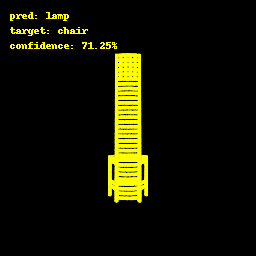
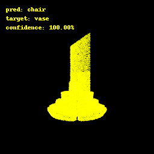
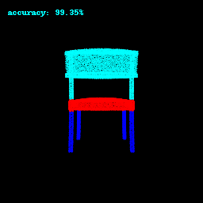
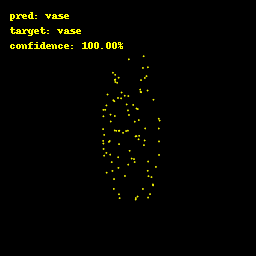
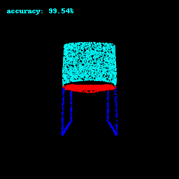

# Assignment 5

### Andrew ID: Rohan Agarwal 
### Late Days used: 1
  

  
I implemented architectures for the classification and segmentation models inspired by the PointNet architecture.

## Q1. Classification Model

`Usage: python train.py --task cls --exp_name pointnet_cls
        python eval_cls.py`
        

|Test Accuracy: | 97.48% |
|-----|--------|

#### Dataset distribution (total samples = 953):

|category|num samples|
|----|---|
|Chair|617|
|Lamp |102|
|Vase  |234|

#### Class-wise correctly classified examples:

| Chair                                     | Lamp                                     | Vase                                    |
|-------------------------------------------|------------------------------------------|-----------------------------------------|
 |   |   |  |
 |   |   |  |

#### Class-wise misclassified examples:

| Chair                                    | Lamp                                    | Vase                                    |
|------------------------------------------|-----------------------------------------|-----------------------------------------|
|  |  |  |
|  |  |  |

The two misclassified examples of chairs shown have shapes less representative of a typical chair (missing base and front legs and unusually long 
back rest). The second chair being mistaken for a lamps makes sense as lamps usually have a taller structure. 
Vases and lamps have rather diverse distributions with high variance in shapes and design and the network can 
confuse one with the other. Reasonably enough, it is also easier for the network to classify taller lamps correctly. 

#### Top best and worst performing examples by confidence score:

- Comment: The dataset is rather skewed with chair being the most frequent class. In my opinion this is why
the top 5 correctly classified examples i.e. correctly classified with high confidence are all chairs and
all worst performing examples i.e. misclassified with high confidence are predicted as chairs. 
The network naturally finds incentive in predicting chairs as even if it were to classify every sample as chair it will still sit
at around 64% accuracy! Additionally, a couple of misclassified examples shown here have flat tops just like most chairs do
and that very likely contributes to the error. 

| Top 5 success cases by predicted confidence | Top 5 failures cases by predicted confidence |
|---------------------------------------------|----------------------------------------------|
|          |            |
|          |            |
|          |            |
|          |            |
|          |            |

## Q2. Segmentation Model

`Usage: python train.py --task seg --exp_name pointnet_seg
        python eval_seg.py`

|Test Accuracy: | 89.95% |
|-----|--------|

- Comment: The model does well on typical-looking chairs -- four legs, flat base and a flat back rest. This is the most abundantly
present structure in the chair category and the network finds it easy to correctly segment them. On the other hand, 
chairs with unusual shapes and structures are hard to get right. These include chair with more than 3-4 segments, 
missing or non-flat backrest, disjointed segments and sofa-like examples. 

#### Top best and worst performing examples by accuracy:

| Top 5 best performing cases   | Top 5 worst performing cases |
|-------------------------------|------------------------------|
|     |   |
|     |   |
|     |   |
|     |   |
|     |   |

## Q3. Robustness Analysis

I experimented with rotating the input point cloud and reducing the number of points in it during test time. 

 
#### Accuracy table (Rotation): 
- Procedure: I rotated the entire dataset using the following formulation: 

            ([[cos(θ)  -sin(θ)   0],
        R = [  sin(θ)   cos(θ)   0],
            [    0        0      1]])

            **test_data = test_data @ Transpose(R)

 
- Comment: The model performance drops sharply as the test data samples are rotated. This is because the network is missing
supervision to learn rotation invariance and rotated samples most-likely constitute out-of-distribution samples for the model for a particular 
  class. I have skipped the implementation of T-Net which learns to align the input point cloud to a canonical space before features
extraction. Therefore, it understandbly breaks under rotated input.  

| rotation | classification | segmentation |
|----------|----------------|--------------|
| 0&deg;   | 97.48%         | 89.95%       |
| 60&deg;  | 37.56%         | 50.76%       |
| 120&deg; | 21.19%         | 33.45%       |
| 180&deg; | 47.32%         | 32.93%       |

#### Accuracy table (Varying number of test data points): 

- Procedure: I reduced the number of points in the test data point clouds and recorded the resulting accuracies for the both tasks.  
 
- Comment: The model performance stays more or less stable even as the number of test data points are reduced. 
This is because the network relies on learning a globally aggregated feature vector which turns out
to be a function of only select critical points. When visualized, these points constitute the 
 skeleton and the boundaries of the object and as long as these points lie in the pruned set of points, the
learned global features doesn't vary significantly. More intuitively, it can be seen that even 1000 points
 are roughly enough to describe the object shape. 
 

| num points | classification | segmentation |
|------------|----------------|--------------|
| 10000      | 97.48%         | 89.95%       |
| 5000       | 97.16%         | 89.89%       |
| 1000       | 97.16%         | 88.94%       |
| 100        | 94.33%         | 81.24%       |

## Classification model:

### Rotation:

`Usage: python eval_cls.py --exp_name cls --rotate --rot_angle 60`

| no rotation                              | rotation        60&deg;                           | rotation        120&deg;                           | rotation         180&deg;                          |
|------------------------------------------|---------------------------------------------------|----------------------------------------------------|----------------------------------------------------|
|   |   |   |   |
|  |  |  |  |
|   |   |   |   |

### Varying number of points

`Usage: python eval_cls.py --exp_name cls --change_n_points --num_points 100`

| num points 10000                         | num points 5000                                        | num points 1000                                        | num points 100                                        |
|------------------------------------------|--------------------------------------------------------|--------------------------------------------------------|-------------------------------------------------------|
|  |  |  |  |
|   |   |   |   |
|   |   |   |   |

## Segmentation Model

### Rotation

`Usage: python eval_seg.py --exp_name seg --rotate --rot_angle 60`

 | rotation 60&deg;                    | rotation 120&deg;                     | rotation 180&deg;                    |
|-------------------------------------|---------------------------------------|--------------------------------------|
|  |   |  |
|  |   |  |
|  |   |  |

### Varying number of points

`Usage:  python eval_seg.py --exp_name seg --change_n_points --num_points 100`

 | num points 100                          | num points 1000                          | num points 5000                          |
|-----------------------------------------|------------------------------------------|------------------------------------------|
 |  |  |  |
 |  |  |  |
 |  |  |  |

